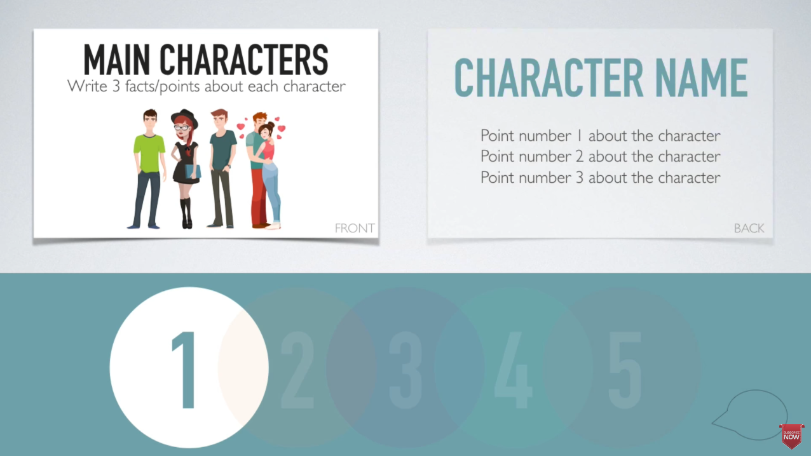

### [SPEAK ENGLISH FLUENTLY IN 5 DAYS | 5-Day Rehearsing Method](https://www.youtube.com/watch?v=t-cj6yRvVrE)
- 5-Day cycle

  
  
- Day1

- 

- | TOPIC | MUSIC                                                        |                                                              |                                                              |                                                              |                                                              |
  | ----- | ------------------------------------------------------------ | ------------------------------------------------------------ | ------------------------------------------------------------ | ------------------------------------------------------------ | ------------------------------------------------------------ |
  | WHO   | Imagine Dragon                                               | Alan my-leader                                               | Jim my swimming coach                                        | Mr. Lee                                                      | My son                                                       |
  | WHAT  | my favorite pop rock band                                    | Mentored me during my probation in the company               | Learned swimming skills from him                             | Taught me knowledge about singing and how to sing properly, encourage me to practicing singing periodically | want to learn  how to play chess called climb prime          |
  | WHEN  | first heard them 2 years ago                                 | after I accepted the offer and decided to move to the city where the company was located | I learned about him when I swam in the gym                   | when I decided to learn sing                                 | He told me one month ago                                     |
  | WHERE | saw their stage performance from a live concert and listened lots of their songs online | the studio was located in Sichuan, Chengdu                   | He taught me in the gym's swimming pool for 1 hour 2 or 3 times a week | he taught me online                                          | I taught him in our dinning room                             |
  | WHY   | They play alternative rock music, very motivated and I like their unique sound and emotional depth of their lyrics | He' always patient to help me out when I got any problem during the work, and we work together to get things down and make things happen in the past two years | He broke down the difficult swimming skills and make it simple to understand by demonstrating in person, and taught me how to do it correctly, he require me practice a lot. after long time practice I eventually be able to swim the hardest style butterfly. | He reminded me that singing is an important part of life and expression | He want to beat me by his math ability and enjoy the moment after winning |

  Day2

  

  Day3

  

  Day4

  

  Day5 don't pay much attention to the grammar and just organize your thoughts based on 5Ws, try to speak as fluent as you can.

  

  
  
  - Q1: Which band do you like best?
  - Q2: Is there anyone who benefit you in your career development?
  - Q3: which sport do you like most? (Is there anyone who influenced you in your life?)
  - Q4: Who is your favorite teacher?
  - Q5: How do you play with your kids? (How do you influence your family?)

### [How to make your English fluent in 5 days](https://www.bilibili.com/video/BV1t84y1B79P?p=14&vd_source=2b3537c234d02f82c699d6ee46f94a38)
-  select 5 topics you're interested in
-  write down 3 reasons to describe why do you like it
   -  Day1
      -  Singing
         -  I like sing, it make me feel good, happy, relaxing, focus on your breathing and physical performance, break from the brain-chatter and worries 
         -  I like listening English song，Research has found that when a subject listens to music that gives them the chills, it triggers a release of dopamine to the brain. And if you don't know, dopamine is a kind of naturally occurring happy chemical we receive as part of a reward system.
         -  Good music affects the mind and make you find inner peace, Listeners turn on music because they are motivated by specific goals.
Music plays an important role in human well-being and health.
Music can serve as an intervention to reduce stress.
      -  Food
         -  I love food
         -  I enjoy exploring local delicious cuisine
         -  I like watching the process of making food, it's another way to understand food.
      -  Sports
         - soccer
         - swimming
         - super bowl parties
      -  Computer
         - working as a programmer
         - gain satisfaction and confidence while bringing new tech to help the product successful
         - keep you thinking ability smooth
      -  Travel
         -  get expose to different people and attractions
         -  open your mind to get know more about the world
         -  experience different culture and cuisine
      
      
      
   -  Day2
      -  Part1: find an article or blog about each topic
         -  singing
            - [5-reasons-why-we-listen-music](https://www.psychologytoday.com/us/blog/science-choice/202110/5-reasons-why-we-listen-music)
            - [why-does-singing-make-us-feel-good](https://www.gold.ac.uk/news/why-does-singing-make-us-feel-good/)
            - [The Science of Singing Along](http://www.doc.gold.ac.uk/~mas03dm/papers/PawleyMullensiefen_Singalong_2012.pdf)
      -  Part2: pick out 3 interesting points for each article you read and list them, you don't have to read every single details of the artical, just skem them and find out the interesting point
         - **Have a good mood**: Research has found that when a subject listens to music that gives them the chills, it triggers a release of dopamine to the brain. And if you don't know, dopamine is a kind of naturally occurring happy chemical we receive as part of a reward system.
         - **Different genre music effects you differently**. Aloud and fast music make you alert and easier to focus on thing, soft and slow music give you a comfortable feeling and make you calm down
         - **Singing and personal development**: Not only does singing give us a natural high, it’s pretty great for our mental wellbeing too. Learning a song is a complicated task for the brain. You have to be coordinated enough to sing the right words at the right time, using the correct pitch and volume, and learn to sing along with other people.
         - **The physical benefits of singing**: Singing involves lots of deep breathing, meaning we take more oxygen into our bloodstream. Controlled breathing also increases lung capacity and has a calming effect on the singer.
         When we sing we stand up straighter and expand our chest, improving posture and toning the diaphragm. We stretch our facial muscles and exercise our vocal chords, which helps in keeping us looking and sounding younger. As an aerobic activity, singing is good for our heart health. It tones the core and ab muscles, stimulates circulation and boosts the immune system. Singing also clears the sinuses, aids sleep, and can help people recover from mental health issues like depression or anxiety.
         - **What happens on a chemical level when we sing**: 
           - boosts endorphin flow
           - resulting in a sense of euphoria, enhanced immune response, and a natural pain relief.
           - helps relieve anxiety and stimulates feelings of trust
           - The sacculus is stimulated by low-frequency high-intensity sounds - like singing
      
      
   -  Day3
      -  Part1: pick 3 vocabulary words you know about that describe the topic
         - chills
         - dopamine and endorphin
         - benefits of singing
         - personal development
      -  Part2: find 3 synonyms for each vocabulary word for each topic
         - relaxing
         - the chemical make you happy, trigger a release of naturally occurring happy in your brain
         - music taste and sense, train your brain
         - phyical improvement
           - involving deep breathing
           - more oxygen into bloodstream
           - spread your lung capacity
           - calm you mind
           - exercise our vocal chords
           - keeping us looking and sounding younger
           - boost immune system
           - getting rid of anxiety and depression
           - tones core and ad muscles
      
   
   - Day4
     - Part1: think of a personal experience connected to each topic
       - summer party
     - Part2: write down 5 W's for each of the experiences that you list in Part1
       - Who: All stuffs of the studio, of course, including me
       - What: performing a song on stage
       - When: in the summer of 2021
       - Where: a outdoor palce where has lots of green plants,lawn, showcase stage and camping area, very suitable for party
       - Why: It's tranditional festival every summer in our company, everyone are willing to join the party, socialize and have fun together, there are delious foods, showcase, and latest news about video games development.
      

 - Day5
   	- create 5 possible questions for each topic
         - Q1: How was it like, I mean the experience about performance on the summer party
         - Q2: which part of the party impress you most?
         - Q3: do you like the summer party?
         - Q4: Is there anything you think we could do it better next time?
         - Q5: What do you look forward to most next summer party?
      	- review the previous four days and see how that information connects
          	- 

      

      

### [HOW TO SPEAK ENGLISH FLUENTLY | 2 SIMPLE STEPS TO SPEAK ENGLISH FLUENTLY & CONFIDENTLY LIKE A NATIVE](https://www.youtube.com/watch?v=VS1FIVkXvE8)

The equation is Reason + Story

- Reason
  
  - repeat the question to connect people
  - give first reason and a bit more detail to support it
  - give second reason and a bit more detail to support it
  - give third reason and a bit more detail to support it
  example:
  
- Story
   
   

How to find a English Parnter

- handy ways to find a parnter

  

  

- express your desiration

### [How to study English with Television Programs](https://www.youtube.com/watch?v=h5JHLIdS85s)

- writes 3 facts/points for each charactor
- 
- when dose the story actually take place
- 
- where does the program happen?
- 
- figure out the main flow of the program by make plots with problem, climax, solution parts for the story
- 
- write down your opinion of the program and give 3 points to explain why do you feel that way?
- 

### [FINALLY THINK AND SPEAK IN ENGLISH](https://www.youtube.com/watch?v=IHjAnyU_GyQ&t=1087s)
